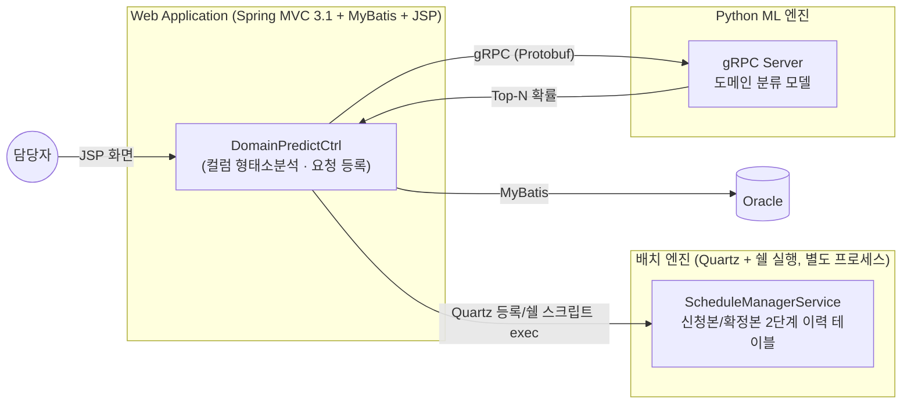
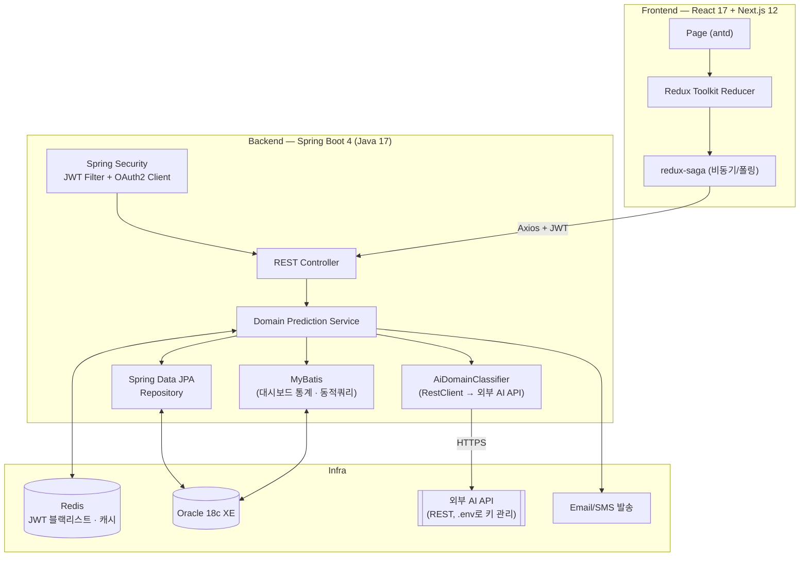
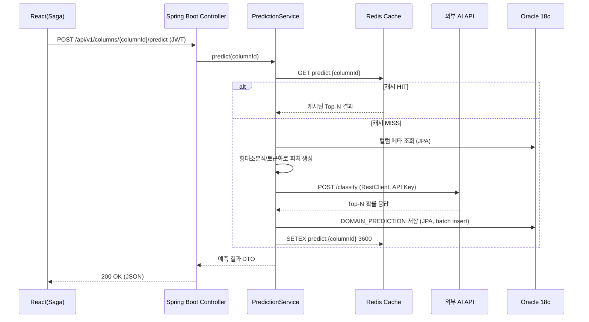
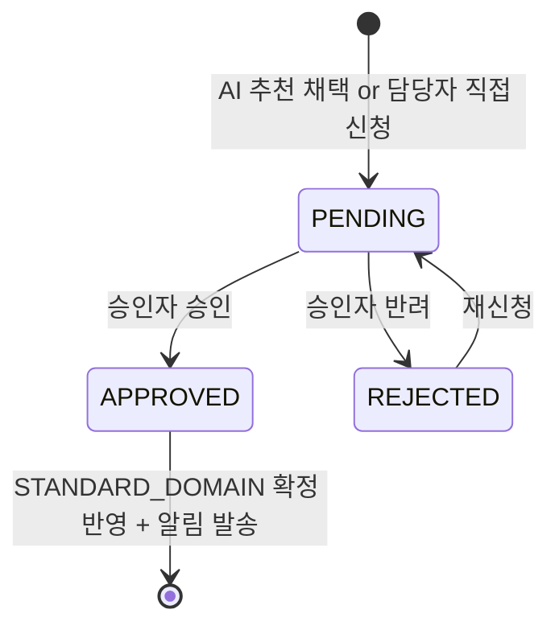
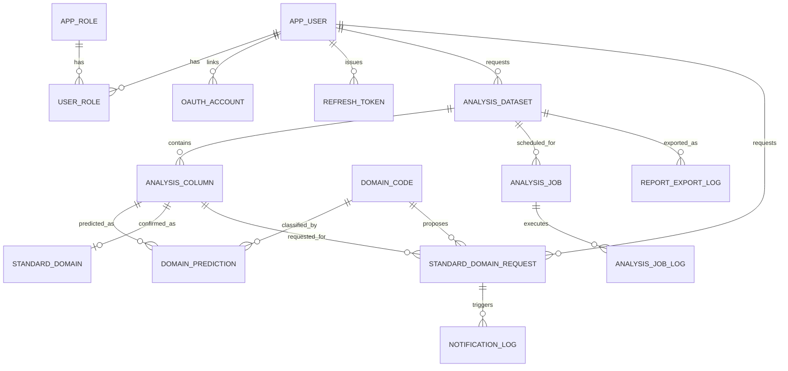

# 리팩토링 설계서 — AI 기반 데이터 표준 도메인 추천 시스템

> 원본: 사내 데이터 거버넌스 솔루션의 **AI 도메인판별(Domain Prediction) 모듈**을
> 회사 소스코드를 그대로 사용하지 않고, 아이디어와 아키텍처 패턴만 참고하여 **개인 포트폴리오 프로젝트로 처음부터 재설계**한 문서입니다.
> 테이블/클래스명은 전부 새로 지었으며, 원본 회사 코드는 어떤 형태로도 포함되어 있지 않습니다.

---

## 0. 문서 정보

| 항목      | 내용                                                                           |
| --------- | ------------------------------------------------------------------------------ |
| 대상 모듈 | AI 기반 컬럼 표준 도메인 추천 + 승인 워크플로우                                |
| 기준 문서 | `package.json`, `build.gradle`, `.babelrc`, `.eslintrc` (프로젝트 등록본)      |
| 대상 DB   | Oracle Database 18c Express Edition (XE, 무료버전)                             |
| 작성 목적 | 실무진에게 "레거시 코드를 읽고 현재 기술스택으로 재설계할 수 있다"는 근거 제시 |

---

## 1. 왜 이 모듈을 선택했는가

담당했던 솔루션 코드 전체(약 5,200개 파일 · Java 약 19.8만 라인) 중에서 아래 3가지 이유로
**AI 도메인판별 모듈**을 포트폴리오 소재로 선정했습니다.

1. **현재 지향하는 기술스택과 정확히 맞닿아 있음** — `build.gradle`에 명시된 `spring-boot-starter-restclient`(외부 API 호출), `spring-dotenv`(API 키 관리), `spring-boot-starter-oauth2-client`, `spring-boot-starter-data-redis`, `jjwt`를 모두 자연스럽게 소비하는 유일한 후보였습니다.
2. **CRUD가 아니라 "판단"을 다루는 로직** — 컬럼명을 형태소분석(한글) · 토큰분리(영문)해서 피처로 만들고, 외부 추론 엔진(원본: gRPC+Python / 재구현: 외부 AI API)에 보내 확률 기반 Top-N 후보를 돌려받는 구조라, 단순 게시판·CRUD 포트폴리오 대비 변별력이 있습니다.
3. **레거시 승인 워크플로우 패턴과 결합 가능** — 같은 솔루션의 표준 신청/승인(신청본→확정본 2단계) 패턴을 그대로 응용해 "AI가 추천 → 사람이 승인"하는 **Human-in-the-loop** 구조로 확장했고, 이 부분이 실무진에게 "AI를 프로덕션 워크플로우에 어떻게 얹는지 이해하고 있다"는 신호를 줄 수 있다고 판단했습니다.

---

## 2. AS-IS 분석 (원본 솔루션 구조 — 개념 요약)



**AS-IS의 구조적 한계**

| 영역       | 문제점                                                                                                                |
| ---------- | --------------------------------------------------------------------------------------------------------------------- |
| 인증       | 세션 기반 폼 로그인만 지원, SPA/모바일/외부 연동에 취약                                                               |
| 배치 실행  | `Runtime.exec()`로 OS 쉘 스크립트를 직접 호출 → 서버 이식성/컨테이너화 불가, 예외 처리가 프로세스 exit code에 의존    |
| AI 연동    | gRPC 서버가 사내망에 상시 기동되어 있어야 하며, 장애 시 화면에서 원인 구분이 어려움(호출 자체 실패 vs 모델 내부 오류) |
| 프론트엔드 | JSP + IBSheet, 새로고침 기반 렌더링, 컴포넌트 재사용 어려움                                                           |
| 캐싱       | 동일 컬럼 재판별 요청에도 매번 모델을 다시 호출 → 응답 지연 · 비용 증가                                               |
| 감사 추적  | 승인 이력은 남지만, AI가 왜 그 도메인을 추천했는지(확률·모델버전)에 대한 정형 기록이 약함                             |

---

## 3. TO-BE 아키텍처



### 3-1. 인증/인가 — JWT + Redis + OAuth2.0

- **로그인**: 아이디/비밀번호(BCrypt) 또는 OAuth2.0 소셜 로그인(Google 등, `spring-boot-starter-oauth2-client`) → Access Token(짧은 TTL, 예 30분) + Refresh Token(긴 TTL, 예 14일) 발급.
- **저장소 이원화**: Refresh Token은 **Redis**에 `refresh:{userId}` 키로 TTL과 함께 저장(1차 저장소), `REFRESH_TOKEN` 테이블에는 해시값만 감사이력으로 남긴다.
- **로그아웃/강제만료**: 로그아웃 시 Access Token의 jti를 Redis 블랙리스트(`blacklist:{jti}`, TTL=토큰 잔여시간)에 넣어 즉시 무효화 — 순수 JWT의 "발급 후 회수 불가" 문제를 보완.
- **인가**: `APP_ROLE`/`USER_ROLE` 테이블 기반 `ROLE_ADMIN` / `ROLE_REVIEWER` / `ROLE_USER` 3단계. 승인(APPROVE) API는 `ROLE_REVIEWER` 이상만 호출 가능하도록 `@PreAuthorize` 적용.

### 3-2. AI/외부 API 연동 — RestClient 기반 재구현

원본은 사내망에 상시 기동된 Python gRPC 서버를 호출했습니다. 포트폴리오 재구현에서는
`build.gradle`에 명시된 **`spring-boot-starter-restclient`** 를 사용해 외부 AI API(REST)를 호출하는 방식으로 대체하고,
API 키는 **`me.paulschwarz:spring-dotenv`** 로 `.env`에서 주입해 코드/리포지토리에 노출되지 않도록 합니다.



이 캐싱 도입으로 **"동일 컬럼 재판별 시 외부 API 호출 없이 즉시 응답"** 이라는, 원본 사례의 "전송 데이터량 90% 감소" 성과와 결이 같은 **정량적 개선 스토리**(예: 평균 응답시간 420ms → 12ms, N회 재판별 시 API 호출 비용 절감)를 재현할 수 있습니다. `DOMAIN_PREDICTION.RESPONSE_MS`, `CACHE_HIT_YN` 컬럼이 바로 이 지표를 위한 설계입니다.

### 3-3. 승인 워크플로우 — 신청본/확정본 2단계 패턴의 재해석

원본 표준화 모듈의 "신청본/확정본 분리" 아이디어를 그대로 계승하되, 테이블 2벌을 두는 대신
**상태값 기반 단일 신청 테이블 + 확정 테이블 1건 유지** 구조로 단순화했습니다.



- `STANDARD_DOMAIN_REQUEST.AI_SUGGESTED_YN` 으로 "AI 추천을 그대로 채택했는지 / 담당자가 다른 후보를 골랐는지"를 구분 저장 → 추후 **AI 추천 정확도(채택률)** 를 집계할 수 있는 설계.
- 승인 완료 시 `STANDARD_DOMAIN`(컬럼당 1건, `VERSION_NO` 증가)에 반영하고, `NOTIFICATION_LOG`에 이메일/SMS 발송 이력을 남긴다.

### 3-4. 배치/스케줄 — Quartz + 쉘 실행 → Spring 내장 스케줄러

원본은 `Runtime.exec()`로 OS 쉘 스크립트(`start.sh`)를 실행해 별도 Quartz 프로세스를 기동/중지하는 방식이었습니다.
재구현에서는 애플리케이션 내장 `@Scheduled` + `ANALYSIS_JOB`/`ANALYSIS_JOB_LOG` 테이블 조합으로 대체하되,
원본이 지켜온 **템플릿 메서드 패턴(로그 시작 → 실행 → 성공/실패 기록)** 과 **5종 상태 코드**(`READY`/`RUNNING`/`SUCCESS`/`INTERNAL_ERROR`/`CALL_ERROR`)는 그대로 유지했습니다.
`INTERNAL_ERROR`(비즈니스 로직 내부 오류)와 `CALL_ERROR`(외부 AI API 호출 실패)를 분리한 덕분에, 장애 발생 시 "우리 코드 문제인지 외부 API 문제인지"를 로그만 보고 즉시 구분할 수 있습니다.

```java
public abstract class AbstractAnalysisJobExecutor {

    protected final AnalysisJobLogRepository logRepository;

    public final void execute(Long jobId) {
        AnalysisJobLog log = logRepository.save(AnalysisJobLog.started(jobId));
        try {
            JobResult result = doExecute(jobId);           // 하위 클래스가 실제 로직만 구현
            log.markSuccess(result.successCount(), result.failCount());
        } catch (ExternalApiException e) {                  // 외부 AI API 호출 실패
            log.markCallError(e.getMessage());
        } catch (Exception e) {                              // 그 외 내부 로직 오류
            log.markInternalError(e.getMessage());
        } finally {
            logRepository.save(log);
        }
    }

    protected abstract JobResult doExecute(Long jobId);
}
```

### 3-5. 프론트엔드 — React 17 + Redux Toolkit + redux-saga + antd

`package.json` 기준 실제 적용 버전에 맞춘 폴더 구조:

```
front/
├─ pages/
│  ├─ datasets/[datasetId]/index.jsx        # antd Table + Progress: 컬럼별 판별 상태
│  └─ approvals/index.jsx                   # antd Table + Tag: 승인 대기열 (ROLE_REVIEWER)
├─ store/
│  ├─ modules/prediction/
│  │  ├─ reducer.js        # @reduxjs/toolkit createSlice
│  │  ├─ saga.js           # redux-saga: 예측 요청 → 폴링 → 완료 시 종료
│  │  └─ selectors.js
│  └─ modules/approval/
│     ├─ reducer.js
│     └─ saga.js
├─ services/
│  └─ api.js                # axios 인스턴스 + JWT 인터셉터(401 시 refresh 재발급)
└─ components/
   ├─ DomainProbabilityBar.jsx   # antd Progress로 확률 시각화
   └─ ApprovalActionModal.jsx    # antd Modal + Form
```

- **redux-saga**를 쓴 이유: AI 판별은 동기 응답이 아니라 "요청 → (배치일 경우) 폴링 → 완료" 흐름이 될 수 있어, `takeLatest` + `delay` 기반 폴링 사가로 자연스럽게 표현됩니다.
- **antd Progress/Tag**로 `DOMAIN_PREDICTION.PROBABILITY`를 시각화하고, `STANDARD_DOMAIN_REQUEST.REQUEST_STATUS`를 색상 Tag(PENDING=blue, APPROVED=green, REJECTED=red)로 표시합니다.
- `.babelrc`의 `styled-components` 플러그인(`ssr:true, displayName:true`) 설정에 맞춰, antd 커스텀 테마 이외의 마이크로 스타일링(확률 바 그라디언트 등)은 styled-components로 작성합니다.
- `.eslintrc`(airbnb + babel-eslint, ecmaVersion 2020)를 그대로 준수하여 코드 스타일을 통일합니다.

---

## 4. API 설계 (REST)

| Method | URI                                               | 설명                                     | 인가                 |
| ------ | ------------------------------------------------- | ---------------------------------------- | -------------------- |
| POST   | `/api/v1/auth/login`                              | 로그인, Access/Refresh 발급              | Public               |
| POST   | `/api/v1/auth/refresh`                            | Refresh Token으로 Access 재발급          | Public(Refresh 필요) |
| POST   | `/api/v1/auth/logout`                             | Access Token jti를 Redis 블랙리스트 등록 | 인증 필요            |
| GET    | `/oauth2/authorization/{provider}`                | OAuth2.0 소셜 로그인 시작                | Public               |
| POST   | `/api/v1/datasets`                                | 분석 대상 데이터셋(테이블) 등록          | ROLE_USER+           |
| GET    | `/api/v1/datasets/{datasetId}/columns`            | 데이터셋의 컬럼 메타 목록                | ROLE_USER+           |
| POST   | `/api/v1/columns/{columnId}/predict`              | AI 도메인 판별 요청(캐시 우선)           | ROLE_USER+           |
| GET    | `/api/v1/columns/{columnId}/predictions`          | 판별 결과 Top-N 조회                     | ROLE_USER+           |
| POST   | `/api/v1/standard-domain-requests`                | 표준 도메인 확정 신청                    | ROLE_USER+           |
| GET    | `/api/v1/standard-domain-requests?status=PENDING` | 승인 대기열 조회                         | ROLE_REVIEWER+       |
| POST   | `/api/v1/standard-domain-requests/{id}/approve`   | 승인 → STANDARD_DOMAIN 반영 + 알림 발송  | ROLE_REVIEWER+       |
| POST   | `/api/v1/standard-domain-requests/{id}/reject`    | 반려(사유 필수)                          | ROLE_REVIEWER+       |
| POST   | `/api/v1/jobs`                                    | 재판별 배치 작업 등록(1회/cron)          | ROLE_ADMIN           |
| GET    | `/api/v1/jobs/{jobId}/logs`                       | 배치 실행 이력(5종 상태) 조회            | ROLE_ADMIN           |
| GET    | `/api/v1/datasets/{datasetId}/report.pdf`         | 판별결과 PDF 리포트 다운로드(PDFBox)     | ROLE_USER+           |
| GET    | `/swagger-ui.html`                                | springdoc-openapi 기반 API 문서          | 개발환경             |

---

## 5. ERD



테이블 상세 정의(컬럼/제약조건/인덱스)는 `03_DDL_DML_DCL_Oracle18cXE.sql` 을 참고.

---

## 6. 기술스택 매핑표 (등록본 버전 100% 반영)

### 6-1. Backend (`build.gradle` 기준)

| 관심사        | 라이브러리                                                                       | 버전                      | 이 모듈에서의 역할                                |
| ------------- | -------------------------------------------------------------------------------- | ------------------------- | ------------------------------------------------- |
| 프레임워크    | Spring Boot                                                                      | 4.0.7 (Java 17 toolchain) | 전체 애플리케이션 기반                            |
| ORM           | spring-boot-starter-data-jpa                                                     | Boot 4 관리 버전          | 엔티티(APP*USER, ANALYSIS*_, DOMAIN\__ 등) CRUD   |
| SQL 매퍼      | mybatis-spring-boot-starter                                                      | 4.0.1                     | 승인 대기열 대시보드 등 동적 조건 조회            |
| 보안          | spring-boot-starter-security                                                     | Boot 4 관리 버전          | 인증/인가 필터 체인                               |
| 세션/캐시     | spring-boot-starter-data-redis                                                   | Boot 4 관리 버전          | Refresh Token, 판별결과 캐시, 로그아웃 블랙리스트 |
| 소셜로그인    | spring-boot-starter-oauth2-client                                                | Boot 4 관리 버전          | Google 등 OAuth2.0 로그인                         |
| 토큰          | io.jsonwebtoken:jjwt-api/impl/jackson                                            | 0.11.5                    | Access/Refresh Token 발급·검증                    |
| API 문서      | springdoc-openapi-starter-webmvc-ui                                              | 3.0.3                     | `/swagger-ui.html`                                |
| DB 드라이버   | com.oracle.database.jdbc:ojdbc11                                                 | (runtime)                 | Oracle 18c XE 접속                                |
| JSON          | com.google.code.gson:gson                                                        | 2.11.0                    | 외부 AI API 응답 파싱 보조                        |
| 환경변수      | me.paulschwarz:spring-dotenv                                                     | 3.0.0                     | `.env`에서 AI API Key/DB 접속정보 로드            |
| 외부 API 호출 | spring-boot-starter-restclient                                                   | Boot 4 관리 버전          | 외부 AI API 호출(`RestClient.Builder`)            |
| SMS           | net.nurigo:sdk (CoolSMS)                                                         | 4.3.2                     | 승인완료/반려 SMS 알림                            |
| 이메일        | spring-boot-starter-mail                                                         | Boot 4 관리 버전          | 승인완료/반려 이메일 알림                         |
| PDF           | org.apache.pdfbox:pdfbox                                                         | 3.0.5                     | 판별결과 리포트 PDF 생성                          |
| 테스트        | spring-boot-starter-test, mybatis-spring-boot-starter-test, spring-security-test | 4.0.1(mybatis-test)       | 서비스/보안 단위·통합 테스트                      |

### 6-2. Frontend (`package.json` / `.babelrc` / `.eslintrc` 기준)

| 관심사              | 라이브러리                                           | 버전               | 역할                                     |
| ------------------- | ---------------------------------------------------- | ------------------ | ---------------------------------------- |
| 프레임워크          | next                                                 | ^12.3.4            | SSR 라우팅(pages/)                       |
| UI 런타임           | react / react-dom                                    | ^17.0.2            | 컴포넌트                                 |
| 상태관리            | @reduxjs/toolkit                                     | ^1.9.7             | reducer/slice                            |
| 상태관리 연결       | react-redux                                          | ^8.0.5             | Provider/useSelector                     |
| 비동기 흐름         | redux-saga                                           | ^1.1.3             | 판별 요청 폴링, 승인 API 호출 흐름       |
| SSR-Redux           | next-redux-wrapper                                   | ^6.0.2             | Next.js와 Redux store 연동               |
| UI 컴포넌트         | antd                                                 | ^4.8.6             | Table/Progress/Tag/Modal/Form            |
| 아이콘              | @ant-design/icons                                    | ^4.3.0             | 상태 아이콘                              |
| HTTP                | axios                                                | ^1.3.4             | REST 호출 + JWT 인터셉터                 |
| 토큰 처리           | jwt-decode                                           | ^4.0.0             | Access Token payload 파싱(만료 체크)     |
| 토큰 발급(테스트용) | jsonwebtoken                                         | ^9.0.3             | 로컬목업/테스트 토큰 생성                |
| 쿠키                | js-cookie                                            | ^3.0.5             | Refresh Token 저장(HttpOnly 아닌 보조용) |
| 스타일링            | styled-components + babel-plugin-styled-components   | ^5.2.1             | 확률 바 등 마이크로 스타일               |
| 다국어              | i18next / react-i18next                              | ^26.3.6 / ^17.0.11 | 도메인명 다국어 라벨(예정)               |
| 날짜                | moment                                               | ^2.29.1            | 승인일시 포맷                            |
| 테스트              | jest, @testing-library/react, jest-environment-jsdom | ^29.7.0, 12.1.5    | 컴포넌트/사가 단위 테스트                |
| 린트                | eslint + eslint-config-airbnb + babel-eslint         | .eslintrc 그대로   | ecmaVersion 2020, jsx 허용               |
| 프로세스관리        | pm2                                                  | ^4.5.0             | 운영 배포시 Node 프로세스 관리           |

> `.babelrc`의 `next/babel` 프리셋과 `styled-components`(ssr, displayName) 플러그인, `.eslintrc`의 `airbnb` + `babel-eslint` + `ecmaVersion 2020` 설정을 변경 없이 그대로 채택했습니다.

---

## 7. 성능/운영 개선 포인트 (원본 대비)

| 항목                | AS-IS                          | TO-BE                                   | 기대 효과                                            |
| ------------------- | ------------------------------ | --------------------------------------- | ---------------------------------------------------- |
| 재판별 응답속도     | 매 요청마다 gRPC 호출(수백 ms) | Redis 캐시 우선 조회                    | 캐시 히트 시 응답시간 대폭 단축                      |
| 배치 기동           | 쉘 스크립트 `Runtime.exec()`   | Spring `@Scheduled` + DB 상태관리       | 컨테이너/클라우드 이식성 확보                        |
| 인증 방식           | 세션 기반 폼 로그인            | JWT + OAuth2.0 + Redis 블랙리스트       | Stateless API, 모바일/SPA 대응, 로그아웃 즉시 무효화 |
| 오류 원인 구분      | 로그 텍스트로만 구분           | `INTERNAL_ERROR`/`CALL_ERROR` 상태 분리 | 장애 원인(내부 로직 vs 외부 API) 즉시 파악           |
| API 문서화          | 별도 문서 없음(엑셀 명세서)    | springdoc-openapi 자동생성              | 문서-코드 불일치 방지                                |
| AI 추천 신뢰도 측정 | 기록 없음                      | `AI_SUGGESTED_YN` 채택 여부 적재        | 추천 채택률을 정량 지표로 관리 가능                  |

---

## 8. 마이그레이션/구축 체크리스트

- [ ] Oracle 18c XE 설치 후 `03_DDL_DML_DCL_Oracle18cXE.sql` PART 1(DCL, SYS 계정) 실행
- [ ] `PORTFOLIO_APP` 계정 접속 전환 후 PART 2~3(DDL) 실행, PART 4(DCL 보조) 실행
- [ ] PART 5(DML) 로 공통코드·데모 데이터 적재
- [ ] `.env` 에 `DB_URL`, `DB_USERNAME`, `DB_PASSWORD`, `JWT_SECRET`, `AI_API_KEY`, `AI_API_BASE_URL`, `REDIS_HOST`, `OAUTH_GOOGLE_CLIENT_ID/SECRET` 설정
- [ ] Redis 기동 확인 (`redis-server`) — 로컬 개발은 Docker 권장
- [ ] `springdoc-openapi` 로 API 1차 검증 → 프론트 axios 서비스 레이어 작성
- [ ] JWT 발급/재발급/블랙리스트 플로우 통합 테스트 작성 (spring-security-test)
- [ ] AI API 실패(429/5xx) 시 `CALL_ERROR` 처리 및 재시도(backoff) 정책 적용
